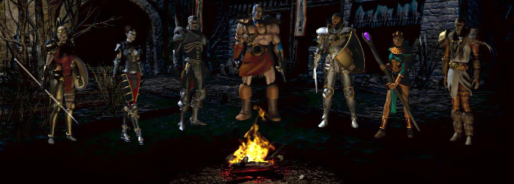

# Back-end Development_Assignment 1

This is the repository for assignment 1 in the Backend development module.

The assignment is to create RPG Characters in a game.

Author = Richard Stølen

Branches:
- main : Contains the required code for the assignment. 
- extending-base-functionality : Experimental branch, contains some extra stuff:
                                    - Main menu where you can create a hero
                                    - Simple combat system.
                                    - An unsuccesful attempt at saving the current game to a CSV file.

## To Do List 

### Appendix A: Hero Classes
1. [x] Introduction and overview
2. [x] Hero attributes
3. [x] Levelling attributes
   1. [x] Mage attribute gain
   2. [x] Ranger attribute gain
   3. [x] Rogue attribute gain
   4. [x] Warrior attribute gain

### Appendix B: Items and equipment
1. [x] Introduction and overview
2. [x] Weapons
3. [x] Armor
4. [x] Equipment
   1. [x] Equipping weapons
   2. [x] Equipping Armor
5. [x] Calculations and display
   1. [x] Calculating total attributes
   2. [x] Calculating a heroes damage
   3. [x] Hero display

### Appendix C: Unit Testing

1. [x] Introduction and overview
      1. [x] When a Hero is created, it needs to have the correct name, level, and attributes
      2. [x] When a Heroes level is increased, it needs to increment by the correct amount and result in the correct attributes
         1. [x] Creation and leveling tests need to be written for each sub class
         2. [x] A test to see if HeroAttribute is being added/increased correctly should also be written
      3. [x] When Weapon is created, it needs to have the correct name, required level, slot, weapon type, and damage
      4. [x] When Armor is created, it needs to have the correct name, required level, slot, armor type, and armor attributes
      5. [x] A Hero should be able to equip a Weapon, the appropriate exceptions should be thrown if invalid (level requirement and type)
      6. [x] A Hero should be able to equip Armor, the appropriate exceptions should be thrown if invalid (level requirement and type)
      7. [x] Total attributes should be calculated correctly
         1. [x] With no equipment
         2. [x] With one piece of armor
         3. [x] With two pieces of armor
         4. [x] With a replaced piece of armor (equip armor, then equip new armor in the same slot)
      8. [x] Hero damage should be calculated properly
         1. [x] No weapon equipped
         2. [x] Weapon equipped
         3. [x] Replaced weapon equipped (equip a weapon then equip a new weapon)
         4. [x] Weapon and armor equipped
      9. [x] Heroes should display their state correctly

2. [x] Example single test walkthrough

### Appendix D: Extensions and alternative approaches (OPTIONAL)

1. [ ] Extending base functionality

2. [ ] Alternative approach

